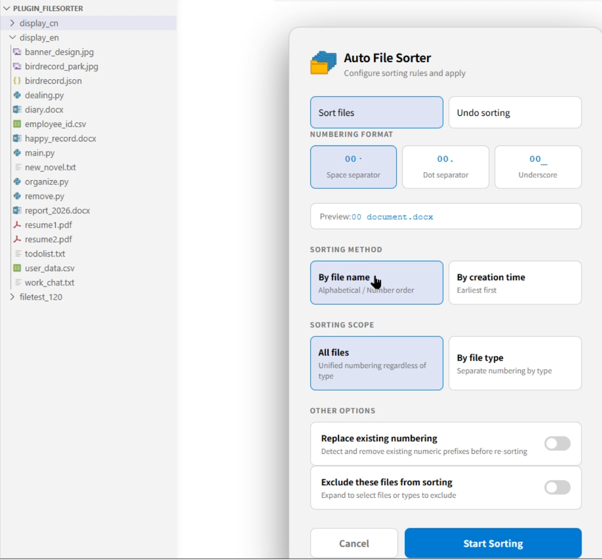

# Auto File Sorter

Automatically group and sort files in a folder by type, and add numbered prefixes to filenames to improve file management efficiency.

---

## Features

| Feature | Description |
|--------|-------------|
| Three numbering formats | `00 filename`, `00.filename`, `00_filename` |
| Adaptive digit length | ≤99 files use 2 digits; 100–999 use 3 digits; >999 prompts folder split |
| File sorting & renaming | Sort and rename files based on selected scope and method |
| Sorting methods | By filename (alphabetical/numeric) or by creation time |
| Replace existing numbering | Remove old numbering and reapply with one click |
| Insert-based auto reordering | Automatically reorder when new unnumbered files are added |

---

## Usage

### Sort a Single Folder

1. In VSCode Explorer, **right-click any folder** → select `Sort & Number This Folder`  
2. In the popup, configure:
   - **Numbering format**: space / dot / underscore
   - **Sorting method**: by name / by creation time
   - **Sorting scope**:
     - All files: ignore file types, unified numbering
     - By file type: grouped numbering
       - Group by type: files are grouped by type
       - Interleaved order: ignore type, display in sequence
   - **Exclude files/types**: optionally exclude specific files or types
3. Click **▶ Start Sorting**

### Sort Entire Workspace

- Open Command Palette (`Ctrl+Shift+P`)  
- Search: `Sort & Number Entire Workspace`

### Undo Sorting

- If numbering matches supported format → click **Undo directly**  
- Otherwise → enter regex of existing numbering → confirm undo

---

## Numbering Examples

### All Files

| Original | After Sorting (space format) |
|----------|----------------------------|
| report.docx | 00 report.docx |
| meeting.docx | 01 meeting.docx |
| budget.xlsx | 02 budget.xlsx |
| cost.xlsx | 03 cost.xlsx |

### Grouped by File Type

| Original | After Sorting |
|----------|--------------|
| report.docx | 00 report.docx |
| meeting.docx | 01 meeting.docx |
| budget.xlsx | 00 budget.xlsx |
| cost.xlsx | 01 cost.xlsx |

---

## Configuration (settings.json)

```json
{
  "autoFileSorter.watchForChanges": true,
  "autoFileSorter.defaultFormat": "space",
  "autoFileSorter.defaultSortBy": "name"
}

```

| Setting           | Values                     | Description                                         |
| ----------------- | -------------------------- | --------------------------------------------------- |
| `watchForChanges` | `true / false`             | Whether to keep watching file changes after sorting |
| `defaultFormat`   | `space / dot / underscore` | Default numbering format                            |
| `defaultSortBy`   | `name / created`           | Default sorting method                              |


---

## Project Structure

auto-file-sorter/
├── src/
│   ├── extension.ts   # Entry point, command registration
│   ├── sorter.ts      # Core sorting & renaming logic
│   ├── watcher.ts     # File watcher & auto reordering
│   └── webview.ts     # Config UI (HTML/CSS/JS)
├── package.json       # Extension manifest
└── tsconfig.json

---

Author： Gina Wang  [GitHub](https://github.com/GinovaCode)
---



### [Watch the video by clicking the link~]

(https://github.com/user-attachments/assets/8edc3526-3c14-4b6a-856a-64a33aac7755)